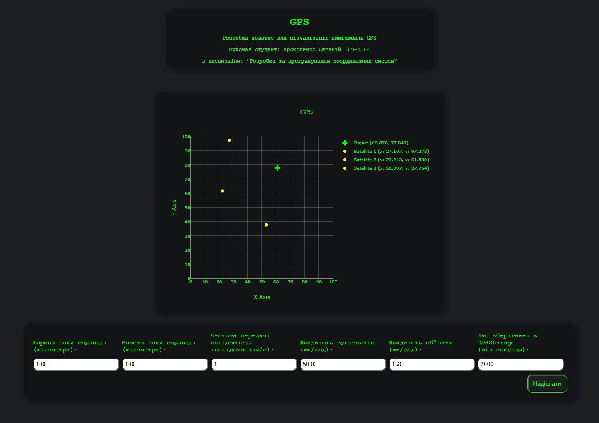
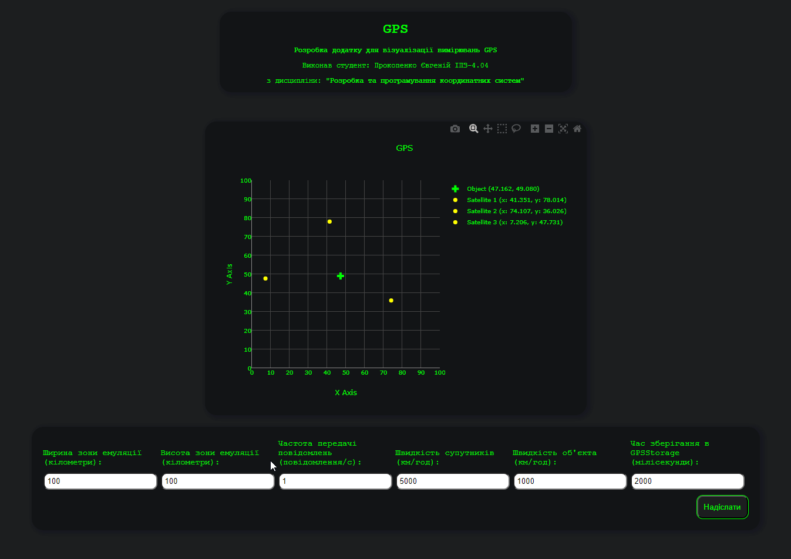

## Титул

<br>

<p align="center" style="font-size: 30px;">
    <b>Розробка додатку для візуалізації вимірювань GPS</b>
</p>
<p align="center" style="font-size: 24px;">
    Виконав студент: Прокопенко Євгеній ІПЗ-4.04
</p>
<p align="center" style="font-size: 24px;">
    з дисципліни: <b>"Розробка та програмування координатних систем"</b>
</p>

<br>

## Мета

Розробити додаток, який зчитує дані з емульованої вимірювальної частини GPS, наданої у вигляді Docker image, та відображає положення об'єкта і супутників на графіку в декартових координатах.

## Завдання

Згідно до поставленого завдання необхідно було створити веб-додаток, що в реальному часі відображає дані про задетектовані цілі на графіку та дозволяє змінювати параметри GPS.

1. **Розробити додаток для відображення положення об'єкта та супутників:**
    - Розробити веб-додаток, який підключається до WebSocket сервера та зчитує дані про положення супутників і об'єкта;
    - Відобразити отримані дані на графіку в декартових координатах. Для цього можна використати бібліотеку Plotly або іншу бібліотеку для роботи з графіками.
2. **Обробка та візуалізація даних:**
    - Обробити дані, отримані через WebSocket, і відобразити положення об'єкта та супутників на графіку;
    - Додати можливість зміни параметрів вимірювальної частини GPS за допомогою API запитів.
3. **Налаштування графіка:**
    - Відобразити координати супутників та об'єкта у декартових координатах;
    - Використати різні кольори або стилі точок для відображення супутників та об'єкта.

## Конфігурація середи

Емулятор GPS надається у вигляді Docker зображення під назвою `gps-emulation-service`.

Команда завантаження Docker зображення з Docker Hub:

> docker pull iperekrestov/university:gps-emulation-service

Запуск контейнера з ім'ям `gps-emulator` з відкриттям порту `4001` для з'єднання з емульованими супутниками:

```bash
 docker run --name gps-emulator -p 4001:4000 iperekrestov/university:gps-emulation-service
```
## API сервіса супутників

Сервіс GPS підтримує API для зміни наступних параметрів:

- `emulationZoneSize` : розмір зони емуляції; 
- `messageFrequency`: частота передачі повідомлень супутниками; 
- `objectSpeed`: швидкість руху об'єкта; 
- `satelliteSpeed`: швидкість руху супутників.

За замовчуванням застосовані наступні параметри:

- `emulationZoneSize` : 200x200 км; 
- `messageFrequency`: кількість повідомлень у секунду, за замовчуванням 1; 
- `objectSpeed`: 10 км/год; 
- `satelliteSpeed`: 100 км/год.

Дані, які надсилаються через WebSocket, містять інформацію про положення супутників та об'єкта. Повідомлення представляються у форматі JSON і мають наступну структуру:

```bash
{
  "id": "uuid", // Унікальний ідентифікатор супутника (UUID)
  "x": 100.5,  // Координати супутника по осі X (у кілометрах)
  "y": 200.3, // Координати супутника по осі Y (у кілометрах)
  "sentAt": 1692170400000,  // Час відправки повідомлення супутником (мілісекунди з початку епохи Unix)
  "receivedAt": 1692170400100 // Час отримання повідомлення об'єктом (мілісекунди з початку епохи Unix)
}

```

## Розробка проєкта

#### 1. Технології

Для створення додатку візуалізації GPS було обрано JavaScript, HTML і CSS через їхню потужність у створенні інтерактивних та стильних інтерфейсів. JavaScript дозволяє динамічно оновлювати дані та управляти взаємодією користувача. HTML надає структуру, а CSS — стилізацію.

Для графіків було вирішено використовувати Plotly, що забезпечує розширені можливості для створення графічних візуалізацій. 

Серверна частина налаштована з використанням `Express` і `middleware` для проксі, що дозволяє зручно обробляти запити, маршрутизацію та є необхідною для вирішення обмежень браузерної системи. `Node.js` забезпечує середовище для виконання серверного коду.
Для управління залежностями було застосовано `npm`. 

#### 2. CORS політика

CORS (Cross-Origin Resource Sharing) — це механізм, який дозволяє веб-додаткам, що виконуються в одному домені, взаємодіяти з ресурсами, що знаходяться на іншому домені.

Для можливості відправлення запиту (наприклад, POST, PUT) з браузеру від імені іншого домену до домену конфігурації Docker зображення GPS (`http://localhost:4001/config`) необхіно, щоб веб-сервер дозволяв подібні запити з інших доменів.

Шляхом випробувань було з'ясовано, що веб-сервер не відповідає на `OPTIONS` запити браузера своїми спеціальними заголовками.

Для вирішення цієї проблеми було зроблено налаштування проксі-сервера з використанням пакетів `express` і `http-proxy-middleware`, для вирішення проблеми з CORS політикою браузера. Проксі-сервер на порту `3000` перенаправляє запити до конфігураційного сервера Docker на `http://localhost:4001`. Це дозволяє обробляти запити, такі як `POST` і `GET`, які можуть бути заблоковані через обмеження `CORS`.

Конфігурація включає:

- Проксі для API: Перенаправлення запитів з /api до цільового сервера, забезпечуючи правильне оброблення заголовків CORS;
- Обробка статичних файлів: Сервер обробляє статичні ресурси з директорії `public`;
- Встановлення гоовної сторінки: Відповідає на запити до кореневого маршруту, надаючи основний HTML файл.

Налаштування веб-серверу відбувається у головному js файлі веб-сервера — `proxy.js`. 

Запуск проєкта виконується командою:

> node proxy.js

#### 3. Приймання повідомлень GPS

Для приймання повідомлення від GPS було створено клас `GPSService`, файл `public/src/GPSService.js`.

Клас `GPSService` забезпечує взаємодію з GPS-системою, надаючи наступні можливості:

- Отримання конфігурації GPS: Метод fetchConfiguration здійснює запит на сервер для отримання актуальної конфігурації системи GPS;

- Оновлення конфігурації GPS: Метод `updateConfiguration` дозволяє змінювати конфігурацію, відправляючи нові параметри на сервер;

- Підключення до WebSocket: Метод `connectWebSocket` ініціює підключення до `WebSocket`, обробляє вхідні повідомлення і генерує кастомні події для обробки даних.

Конструктор класу приймає об'єкт props, що містить такі параметри:

- `configUrl`: URL-адреса для отримання конфігурації GPS;
- `socketUrl`: URL-адреса для підключення до WebSocket;
- `eventName`: Назва події, яка генерується при отриманні даних з `GPS`.

**Отримання конфігурації**

Метод `fetchConfiguration` виконує HTTP-запит до сервера для отримання поточної конфігурації:

```javascript

const response = await fetch(this.props.configUrl, {
  method: "GET",
  headers: {
    "Content-Type": "application/json",
  },
});
```

**Оновлення конфігурації**

Метод `updateConfiguration` відправляє нову конфігурацію на сервер:

```javascript
const response = await fetch(this.props.configUrl, {
  method: "POST",
  headers: {
    "Content-Type": "application/json",
  },
  body: JSON.stringify(newConfig),
});
```

**Підключення до WebSocket**

Метод `connectWebSocket` ініціює підключення до `WebSocket`, обробляє вхідні повідомлення у форматі JSON, генерує події та обробляє помилки:

```javascript
this.websocket = new WebSocket(this.props.socketUrl);

this.websocket.onmessage = (event) => {
  try {
    const data = JSON.parse(event.data);
    const customEvent = new CustomEvent(this.props.eventName, {
      detail: data,
    });
    window.dispatchEvent(customEvent);
  } catch (error) {
    console.error("Failed to parse data:", error);
  }
};
```

#### 4. Зберігання та обробка данних супутників

Для зберігання та обробка данних супутників було створено клас `GPSStorage`, файл `public/src/GPSStorage.js`.

Основні можливості класу:

**Ініціалізація:**

Конструктор приймає параметр `storageTime`, який визначає час зберігання даних супутників (за замовчуванням 2000 мс). Клас зберігає налаштування у об'єкті config та дані супутників у структурі Map.

```javascript
constructor(storageTime = 2000) {
  this.config = {};
  this.sateliteData = new Map();
  this.config.storageTime = storageTime;
}
```

**Додавання даних супутників:** 

Метод `addSateliteData(data)` приймає об'єкт даних, розраховує відстань до об'єкта на основі затримки часу між відправкою та отриманням даних, а також встановлює таймер для видалення даних після `storageTime`. 

Додатково, об'єкту даних додається властивість `distance`, яка зберігає обчислену відстань.

```javascript
const distance = (timeDelay * speedOfLight) / 2;
```

**Оновлення конфігурації:** 

Метод `updateConfiguration(config)` дозволяє оновлювати налаштування з нового об'єкта конфігурації.

```javascript
this.config.storageTime = config.GPSStorage.storageTime;
```

**Обчислення координат об'єкта:**

Метод `getObjectPosition()` використовує дані супутників для обчислення координат об'єкта. Якщо є менше ніж три точки, повертається статус `"waitingforsatellite"`. Інакше, обчислюються координати об'єкта та перевіряється, чи знаходяться вони в межах заданої еміляційної зони.

```javascript
if (pointsArray.length < 3) {
  return {
    points: pointsArray,
    status: "waitingforsatellite",
    objectCoordinates: null,
  };
}
```

**Підготовка даних:** 

Метод `prepareDots()` отримує дані супутників, сортує їх за часом додавання (найновіші першими) і вибирає останні три супутники для подальшої обробки.

```javascript
sateliteArray.sort((a, b) => b.addedAt - a.addedAt);
```

#### 5. Будування графіка GPS

Для керуванням створення та оновлення графіка GPS, було створено клас `GPSGraph`, файл `public/src/GPSGraph.js`.

Клас `GPSGraph` реалізує графік для відображення координат об'єкта та супутників, використовуючи бібліотеку Plotly для візуалізації. Основні функції класу включають ініціалізацію графіка, оновлення конфігурації та рендеринг даних на графіку.

**Основні властивості:**

- `started`: Логічне значення, яке вказує, чи графік запущено;
- `angle`: Змінна, яка може використовуватися для обчислення кута в графіку;
- `trace_set`: Набір для зберігання трас (даних), які будуть візуалізовані на графіку;
- `plotId`: Ідентифікатор елемента DOM, в якому буде відображено графік;
- `layout`: Конфігурація графіка, яка визначає його зовнішній вигляд і параметри, такі як назви осей, кольори сітки та фонові кольори.

**Основні методи:**

- Конструктор:

Приймає `plotId`, який використовується для прив'язки графіка до певного елемента в HTML.

Ініціалізує властивості класу та встановлює конфігурацію графіка, включаючи параметри осей та стилі.

```javascript
constructor(plotId) {
    this.started = false;
    ...
    this.layout = {
        title: "GPS",
        xaxis: {
            title: "X Axis",
            ...
        },
        yaxis: {
            title: "Y Axis",
            ...
        },
        ...
    };
}
```

- `updateConfiguration(config)`:

Оновлює конфігурацію графіка відповідно до нових даних з об'єкта конфігурації.
Змінює діапазони осей `X` і `Y` на основі значень `emulationZoneSize`.

```javascript
updateConfiguration(config) {
    let width = config.GPSService.emulationZoneSize.width;
    ...
}
```

- `init(GPSStorage_)`:

Ініціалізує графік, зв'язуючи його з об'єктом `GPSStorage`, з якого будуть отримуватися дані.
Запускає інтервал, який регулярно викликає метод render для оновлення графіка.

```javascript
init(GPSStorage_) {
    this.storage = GPSStorage_;
    setInterval(() => {
        this.render();
        ...
    }, 20);
    this.started = true;
}
```

- `render()`:

Відповідає за візуалізацію даних на графіку, малюючи позиції об'єкта та супутників.
Формує трасировки для об'єкта, якщо знайдено три точки, та додає їх до `trace_set`.
Додає траси для супутників, використовуючи їх координати.

#### 6. Оновлення конфігурації

Для керуванням форми оновлення конфігурації GPS, було створено клас `GPSConfig`, файл `public/src/GPSConfig.js`.

**Основні властивості:**
- `formElement`: HTML-елемент форми, з яким працює клас;
- `validator`: Об'єкт, що містить методи для валідації полів форми;
- `callback`: Функція, яка викликається після успішного створення конфігураційного об'єкта;
- `configs`: Map, що використовується для зберігання конфігураційних значень, розподілених за ключами.

**Основні методи:**
- Конструктор:

Приймає `formElement`, `validator` і `callback` та ініціалізує їх.
Додає слухача події `submit`, який викликає метод `handleSubmit`.

```javascript
constructor(formElement, validator, callback) {
    this.formElement = formElement;
    ...
    this.formElement.addEventListener("submit", this.handleSubmit.bind(this));
}
```

- `handleSubmit(event)`:

Обробляє подачу форми, запобігаючи її стандартній поведінці.
Створює об'єкт конфігурації за допомогою методу `createConfigObject` та викликає `callback`, якщо дані валідні.

```javascript
handleSubmit(event) {
    event.preventDefault();
    const formData = this.createConfigObject();
    if (formData) {
        this.callback(formData);
    }
}
```

- `createConfigObject()`:

Створює об'єкт конфігурації, збираючи значення з полів форми.
Валідує значення полів за допомогою `validateField` та структурує їх у вкладений об'єкт.

```javascript
createConfigObject() {
    const inputContainers = this.formElement.querySelectorAll(".inputContainer");
    ...
}
```

- `addNestedConfig(config, name, value)`:

Додає вкладене значення до конфігурації на основі імені поля, яке містить крапки для вказівки вкладеності.

```javascript
addNestedConfig(config, name, value) {
    const keys = name.split(".");
    ...
}
```

- `validateField(fieldName, value, errorContainer)`:

Валідує окремі поля форми, викликаючи відповідний метод з об'єкта `validator`.
Якщо валідація не проходить, відображає повідомлення про помилку.

```javascript
validateField(fieldName, value, errorContainer) {
    const methodName = this.formElement.querySelector(`[name="${fieldName}"]`).getAttribute("data-validation");
    ...
}
```

- `getConfigObject()`:

Повертає фінальний об'єкт конфігурації, збираючи дані з `configs`.

```javascript
getConfigObject() {
    const result = {};
    this.configs.forEach((value, key) => {
        result[key] = value;
    });
    return result;
}
```

- `setConfig(config)`:

Встановлює значення конфігурації в поля форми, заповнюючи їх відповідно до даних, переданих у метод.

```javascript
setConfig(config) {
    const inputContainers = this.formElement.querySelectorAll(".inputContainer");
    ...
}
```

- `setNestedConfigValue(config, keys, input)`:

Встановлює значення для вкладених полів на основі ключів та переданого елемента.

```javascript
setNestedConfigValue(config, keys, input) {
    let current = config;
    ...
}
```

- `clearErrors()`:

Очищає повідомлення про помилки в формі, видаляючи текст з контейнерів для помилок.

```javascript
clearErrors() {
    const inputContainers = this.formElement.querySelectorAll(".inputContainer");
    ...
}
```

#### 7. Головний скрипт index.html

При готовності документа виконується запуск головної асинхронної фунції.

**Основні компоненти:**
1. **Імпорт необхідних модулів**:

    - `GPSService`: обробляє функціональність GPS, включаючи отримання конфігурацій;
    - `GPSGraph`: відповідає за візуалізацію GPS-даних;
    - `GPSConfig`: керує формою конфігурації для GPS;
    - `GPSConfigValidator`: забезпечує валідацію введених даних конфігурації;
    - `GPSStorage`: зберігає GPS-дані

2. **Визначення властивостей для сервісу GPS**:

Конфігурація містить URL для конфігураційного API та `WebSocket`.
```javascript
let GPSServiceProps = {
    configUrl: "http://localhost:3000/api/config",
    socketUrl: "ws://localhost:4001",
    eventName: "gpsDataReceived",
};
```
3. **Ініціалізація екземплярів класів**:

Створюються екземпляри для `GPSService`, `GPSGraph`, `GPSStorage`, та `GPSConfigValidator`.

```javascript
const gpsService = new GPSService(GPSServiceProps);
const gpsGraph = new GPSGraph("plot");
const gpsStorage = new GPSStorage();
const gpsValidator = new GPSConfigValidator();
```
4. **Головна асинхронна функція `main()`**:

    - Отримання конфігурації: Викликається метод `fetchConfiguration()` для отримання початкових налаштувань;
    - Підключення `WebSocket`: Запускається підключення для отримання GPS-даних в режимі реального часу;
    - Ініціалізація `GPSConfig`: Створюється об'єкт `gpsConfig`, який передає форму, валідатор, та колбек для обробки конфігураційних даних;
    - Налаштування початкової конфігурації: Встановлюється початкова конфігурація для `GPSService` та `GPSStorage`;
    - Обробка подій: Додається слухач для події `gpsDataReceived`, який обробляє отримані дані від супутників;
    - Оновлення конфігурації: Оновлюється конфігурація для графіку та сховища даних;
    - Ініціалізація графіку: Викликається метод `init()` для графіку, щоб відобразити дані супутників.

#### 8. Результат

Виконаємо запуск проєкта: Docker зображення та проксі сервера.

**Результат:**

<br>
<div align="center">
    
</div>
<br>

Спробуємо змінити параметри GPS.

**Результат:**

<br>
<div align="center">
    
</div>
<br>

**GPS працює, запити зміни конфігурації виконуються!**

## Висновок

GPS (Глобальна система позиціонування) є невід'ємною частиною сучасного життя, оскільки забезпечує точну інформацію про місцезнаходження об'єктів у реальному часі. Ця технологія широко використовується в різних сферах, таких як навігація, транспорт, сільське господарство, геодезія та багато інших. Розробка додатків на основі даних GPS має велику цінність, оскільки дозволяє користувачам отримувати точну інформацію про їхнє місцезнаходження, планувати маршрути, оптимізувати логістику і моніторити рух об'єктів.

У ході виконання цієї роботи я підтвердив теоретичний матеріал з теми розробки додатку для візуалізації вимірювань GPS, а саме: розробив додаток, який зчитує дані з емульованої вимірювальної частини GPS, наданої у вигляді Docker image, та відображає положення об'єкта і супутників на графіку в декартових координатах.

Отриманні знання та навички являють собою основу при розробці програмних систем та при вивчені дисципліни `Розробка та програмування координатних систем` в цілому.